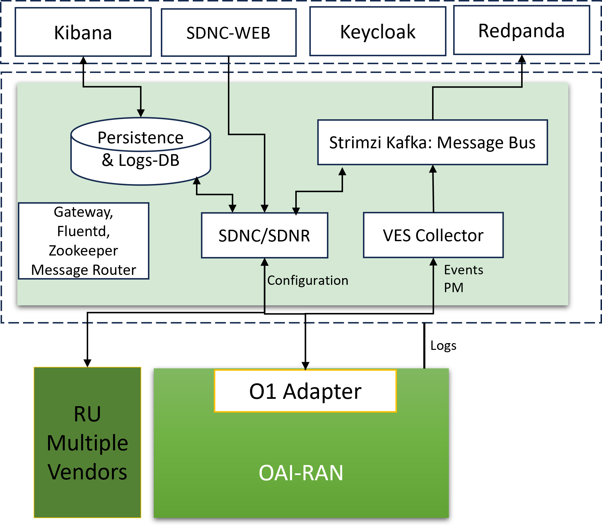
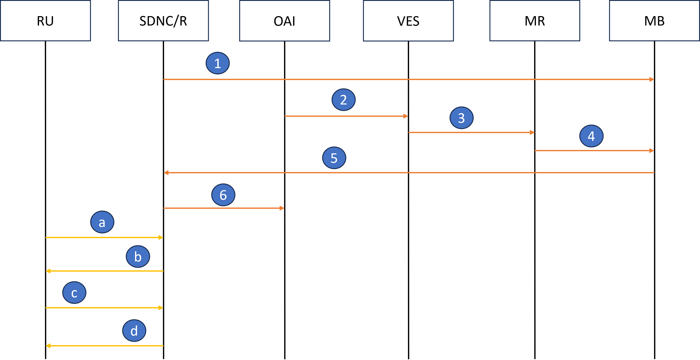

.. SPDX-License-Identifier: CC-BY-4.0

RAN Configuratoin and Fault Management
======================================

The below figure shows the components of the OAM that handle the configuration, fault and log management of RAN.

- VES collector receives Events (ex: pnfRegistration and Alarms) from RAN components.
- All received events are pushed to a Kafka Bus.
- SDNC receives these events and based on the information, and connects with the CU/DU of RAN. In addition, SDNC also responds to Netconf callhome messages from RU and following a successful handshake and ssh-connectivity, manages the RU. This process is explained in the below figure:

  1. SDNC registers with the Message bus for the interested topics.
  2. RAN component (CU/DU) send pnfRegistration to the VES collector
  3. VES collector sends it to message-router - specifying the topic.
  4. The message-router, adds the message in the requested topic - the topic will be created, if it is not present.
  5. SDNC receives the registration message.
  6. SDNC connects to the CU/DU.

- All Alarms from the RAN are received by SDNC, and can be visualized through SDNC-Web.  
