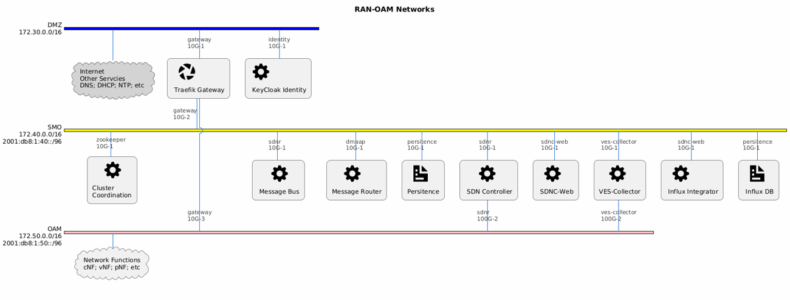

.. This work is licensed under a Creative Commons Attribution 4.0 International License.
.. SPDX-License-Identifier: CC-BY-4.0

OAM Configuration
=================

This documents the configuration of the various components before deployment.

Important Configuration Parameters
----------------------------------

Only important configurations are documented here:

+--------------------+-----------------------------------------------------+----------------------+
| Parameter          | Description                                         | Location             |
+====================+=====================================================+======================+
| HOST_IP            | IP of the system on which OAM is running.           | Multiple             |
|                    | This is managed through adapt_to_environment script |                      |
+--------------------+-----------------------------------------------------+----------------------+
| DEFAULT_DOMAIN     | Domain name to use to access the components.        | Multiple             |
|                    | This is managed through adapt_to_environment script |                      |
+--------------------+-----------------------------------------------------+----------------------+
| SDNC Topics        | Topics SDNC would listen to                         | config/controller/   |
|                    |                                                     | mountpoint-registrar |
|                    |                                                     | .properties          |
+--------------------+-----------------------------------------------------+----------------------+
| KAFKA_BROKERS      | Name of the Message bus container/pod               | Multiple .yaml       |
| bootstrap servers  |                                                     | and .json            |
+--------------------+-----------------------------------------------------+----------------------+
| DMAAPHOST          | Name of the Message router container/pod            | ves-collector        |
|                    |                                                     | docker compose file  |
+--------------------+-----------------------------------------------------+----------------------+

Kafka Topics
------------

+---------------+---------------------------------------------------+-------------------+
| Component     | Topic                                             | Producer/Consumer |
+===============+===================================================+===================+
| VES-Collector | Multiple refer to                                 | Producer          |
|               | config/ves-collector/ves-dmaap-config.json        |                   |
+---------------+---------------------------------------------------+-------------------+
| SDNC          | Multiple refer to                                 | Consumer          |
|               | config/controller/mountpoint-registrar.properties |                   |
+---------------+---------------------------------------------------+-------------------+
| DFC           | unsecured.3GPP-PERFORMANCEASSURANCE-OUTPUT        | Consumer          |
+---------------+---------------------------------------------------+-------------------+
| DFC           | collected-file                                    | Producer          |
+---------------+---------------------------------------------------+-------------------+
| PM Datafile   | collected-file                                    | Consumer          |
| Converter     |                                                   |                   |
+---------------+---------------------------------------------------+-------------------+
| PM Datafile   | json-file-ready-kpadp                             | Producer          |
| Converter     |                                                   |                   |
+---------------+---------------------------------------------------+-------------------+
| PM Producer   | json-file-ready-kpadp                             | Consumer          |
+---------------+---------------------------------------------------+-------------------+
| PM Producer   | pmreports                                         | Producer          |
|               | Dynamically created                               |                   |
+---------------+---------------------------------------------------+-------------------+
| PM Logger     | pmreports                                         | Consumer          |
+---------------+---------------------------------------------------+-------------------+

OAM Networks
------------

OAM Networks should be configured according to this figure in docker-compose-common.yaml

