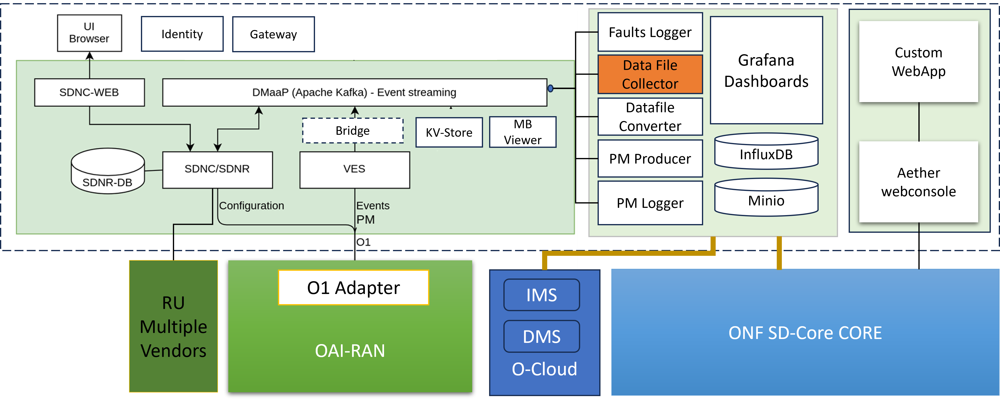

.. This work is licensed under a Creative Commons Attribution 4.0 International License.
.. SPDX-License-Identifier: CC-BY-4.0

OAM Operation and Maintenance Overview
======================================

The OAM project provides administrative and operator
functions for O-RAN components such as Near-Realtime-RAN-Intelligent-Controller,
O-RAN Centralized Unit, O-RAN Distributed Unit and O-RAN Radio Unit, and Core components.

For RAN, the project follows the specifications for the `O1 interface <https://www.o-ran.org/specifications>`_
as provided by O-RAN Working Group 10.

The OAM component in IOSMCN, as shown in the figure below, is mainly derived from O-RAN-SC's OAM and Non-RT-RIC RanPM projects, and ONF Aether's Webconsole.
Apart from these upstream projects, IOSMCN has developed a Unified Gui, which will eventually be single visualization solution for the complete OAM. 

   OAM Architecture

Project Resources
-----------------
The project uses the following Linux Foundation resources:

* The source code is maintained in this Gerrit:
    `<https://github.com/ios-mcn-smo/oam>`_

Scope
-----

RAN - CM, FM and PM
*******************

According to the `O-RAN-OAM-Architecture document <https://www.o-ran.org/specifications>`_
all ManagedElements (ME) (near-real-time-RIC, O-CU-CP, O-CU-UP, O-DU and O-RU)
implement the O1-interface.

The O-RAN-OAM-interface specification defines

- a NetConf-Server for Configuration Management (CM) and
- a http-client for Fault Management (FM), Performance Management (PM) and other
  events on each Management-Service-Provider (MnS-Provider) running on the
  ManagedElement.

RAN - PM (File Ready)
*********************

A PM report (containing aggregated PM measurements over a time interval) is
an XML file. The format is defined by 3GPP. The files are collected from the RAN and stored. An rApp can subscribe for chosen measurement types from measured resources in the network.

CORE
****

The Core OAM includes

- Device/Subsriber Management
- Device Gourping
- Slice Management
- Performance Management
- Log Management.
